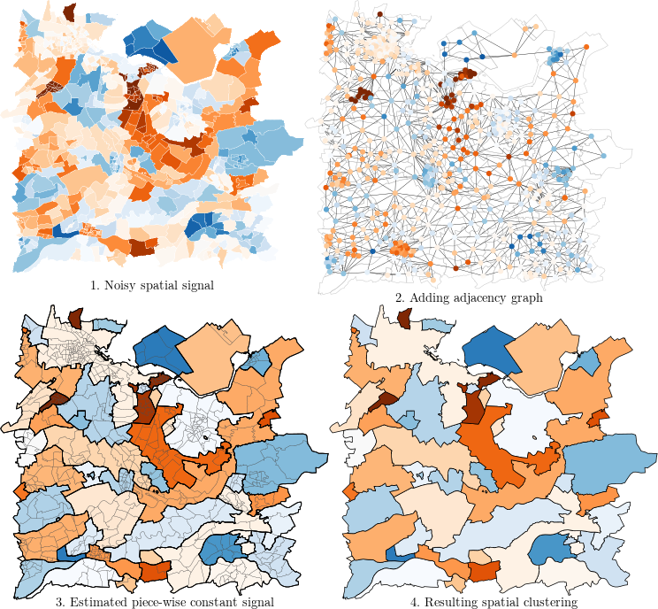

# graphseg-paper

## Presentation

The goal of this repository is to make available the code used for the paper [Goepp and van de Kassteele (2021)](https://arxiv.org/abs/2206.06752).
It provides all the code necessary to reproduce the paper's figures, simulation results and real data application results.

This research paper introduces a method for defining clusters on graph-based signals. It is applied in the domain of spatial statistics for detecting clusters in areal data. 

The method developed in the paper is available in the R package [graphseg](https://github.com/goepp/graphseg).

Below is a visual illustration of the method, producing a clustering of a spatial signal. The areas used are the neighborhoods around the city of Utrecht, NL:



*Keywords: Graph signal processing, Areal lattice data, Spatial clustering, Hot spot detection, Graph-fused lasso, Adaptive Ridge*


## Organisation of this repository

- `simu/` contains all simulations done in the paper:
	- `graphical_abstract/` is used to generate the illustrative example displayed in the graphical abstract
	- `figure/` contains figures used in the paper
	- `synthetic/` contains the R objects defining the 6 datasets
	- `synthetic/` gathers the `.rds` files  used for simulations: the adjacency graph and the `sf` object, for each simulation setting.
	- `table/` contains the table summarizing the simulation resutls in latex format.

	- **Runtime experiments**: `computing_time.R` runs simulations comparing the computing time of the `graphseg::agraph` method with `flsa` (see the paper). `extract_subgraph.R` creates the subgraphs of different size to run the runtime experiments.
	- **Additional runtime experiments** (not shown in the paper): `computation_time_wrt_q.R` runs runtime simulations showing that the number of zones does not impact the runtime (see paper). `extract_subgraph_wrt_q.R` extracts the subgraphs needed for this simulation.

	- **Download and formatting** the geographical areal data: `fetch_save_data.R` downloads the areal data (into `cbs*/`) and `format_dataset.R` converts them to `sf` format and saves them under `simu/synthetic/`.
	- `df_rms_dim_clust_score_table.R` formats the simulation results into latex tables.

	- **Running simulations**: `infer_<region>_<area>_pc_<zone>.R` (for instance `infer_utrecht neigh_pc_municip.R`) are the script running the simulations on the 6 simulation settings. `infer_any.R` runs simulations on all 6 settings.
	- **Running simulations on a cluster**: `script_infer_x.sh` (where x=1..6) are bash scripts to run simulations on a cluster, running the scheduler [slurm](https://slurm.schedmd.com/). `script_infer_any.sh` factorizes the code to run any of the 6 simulations. `script_computation_time.sh` runs the runtime simulations in `computation_time.R`.
	- **Running simulations on a local machine**: we can use `parallel::mclapply` to run simulations in parallel. `parallel_utrecht_neigh_pc_municip.R` shows how. The files for the five other simulation settings are not available.

	- **Plotting the outcome of the method**: `plot_all_input_signals.R` produces the figures of the noisy signal and `plot_any.R` produces the figures of the estimated clustering obtained by out method in the 6 settings.

- `real_data/` contains the real data application done in the paper:

	- `raw_data/map_netherland.geojson` is the spatial data defining the geographical areas.
	- `raw_data/mrf_overweight_utrecht.txt` is the signal to be segmented by our method: the odds-ratio of being overweight for each neighborhood in the region of Utrecht. More details in Goepp and van de Kassteele (2021) and in [van de Kassteele et al (2017)](https://doi.org/10.1186/s12942-017-0097-5).

	- **Pre-processing**: the spatial signal is the estimate of a previous estimation method. It comes with an estimate of its covariance matrix, which is stored in `raw_data/V_mrf.txt`. ` precision_matrix_sparse.R` computes its inverse (the precision matrix) under the assumption that it is sparse. The result is stored in `utrecht_prec.RData`.

	- `utrecht_mrf.R`: main file, performing spatial segmentation (i.e. clustering) of the odds-ratio of overweight in the Utrecht region. The estimates are stored in `results/`.
	
	- Creating figures: `plot_mrf_agraph_flsa.R` produces the figures of the segmented spatial signal.

- `utils/` contains utility R functions:
	- `infer_functions.R` contains the implementation of the graph-sued adaptive ridge method used in the paper. It is a snapshot of the R package [graphseg](https://github.com/goepp/graphseg), plus a few wrapper functions.
	- `div_pal.R` contains functions for setting color scales in the figures.
	- `sf2nb.R` contains a utility functions for defining the adjacency graph from the geographical areal data.

## Installation

The R packages used in this repository are stored in a [renv](https://rstudio.github.io/renv/). An `renv` allows to run the R code in this repo with the same package versions. Here are the steps for running the code of this repo:

- clone it: `git clone https://github.com/goepp/graphseg-paper.git`
- install renv: `install.packages("renv")`
- activate the `renv` : `renv::activate()`. At this point, R is using a different `.libPath` for this project. You can check it by running `.libPaths()`.
- setup the packages stored in renv: `renv::restore()`

`renv` does not allow complete reproducibility. Some remarks:

- I used R version 4.2.1. Make sure you have a version >=4.2.1 and not too far away from it if possible. 
- This repo was written using Ubuntu 22.04 LTS. On Linux, there are some linux packages you may need to install before installing the R packages:

```
sudo apt install libgeos-dev
sudo apt install libharfbuzz-dev libfribidi-dev
sudo apt install libfontconfig1-dev
sudo apt install libfreetype6-dev libpng-dev libtiff5-dev libjpeg-dev
sudo apt install libudunits2-dev
sudo apt install libgdal-dev
sudo apt install cmake
sudo apt install r-cran-rjava
sudo apt install default-jdk && sudo R CMD javareconf
```

## References
- Hoefling, H. (2010). A Path Algorithm for the Fused Lasso Signal Approximator. Journal of Computational and Graphical Statistics, 19(4), 984–1006. [link](http://www.jstor.org/stable/25765384)
- Goepp and van de Kassteele (2021). Graph-Based Spatial Segmentation of Health-Related Areal Data, *to be published* [link](https://doi.org/10.48550/arXiv.2206.06752)

